# Распределенный чат на Node.JS и Redis


Небольшой вопрос/ответ:

*Для кого это?* Людям, которые мало или вообще не сталкивались с распределенными системами, и которым интересно увидеть как они могут строится, какие существуют паттерны и решения.

*Зачем это?* Самому стало интересно что и как. Черпал информацию с разных источников, решил выложить в концентрированном виде, ибо в свое время сам хотел бы увидеть подобную работу. По сути это текстовое изложение моих личных метаний и раздумий. Также, наверняка будет много исправлений в комментариях от знающих людей, отчасти это и есть целью написания всего этого именно в виде статьи. 

## Постановка задачи

Как сделать чат? Это должно быть тривиальной задачей, наверное каждый второй бекендер пилил свой собственный, так же как игровые разработчики делают свои тетрисы/змейки и т. п. Я взялся за такой, но чтоб было интереснее он должен быть готов к захвату мира, чтоб мог выдерживать сотниллиарды активных пользователей и вообще был неимоверно крут. Из этого исходит ясная потребность в распределенной архитектуре, потому что вместить все воображаемое количество клиентов на одной машине - пока нереально с нынешними мощностями. Заместо того чтоб просто сидеть и ждать на появление квантовых компьютеров я решительно взялся за изучение темы распределенных систем. 

Стоит отметить что быстрый отклик очень важен, пресловутый realtime, ведь это же **чат**! а не доставка почты голубями. 

%*рандомная шутка про почту россии*%

Использовать будем Node.JS, он идеален для прототипирования. Для сокетов возьмем Socket.IO. Писать на TypeScript.

И так, что вообще мы хотим:

1. Чтоб пользователи могли слать друг-другу сообщения
2. Знать кто онлайн/оффлайн

Как мы это хотим:

## Сингл сервер

Тут нечего говорить особо, сразу к коду. Объявим интерфейс сообщения:

```typescript
interface Message{
    roomId: string,//В какую комнату пишем
    message: string,//Что мы туда пишем
}
```

На сервере:

```typescript
io.on('connection', sock=>{
    
    //Присоеденяемся в указанную комнату
    sock.on('join', (roomId:number)=> 
            sock.join(roomId))
    
    //Пишем в указанную комнату
    //Все кто к ней присоеденился ранее получат это сообщение
	sock.on('message', (data:Message)=> 
            io.to(data.roomId).emit('message', data))
})
```

На клиенте что-то типа:

```typescript
sock.on('connect', ()=> {
    const roomId = 'some room'
    
    //Подписываемся на сообщения из любых комнат
    sock.on('message', (data:Message)=> 
            console.log(`Message ${data.message} from ${data.roomId}`))
    
    //Присоеденяемся к одной
    sock.emit('join', roomId)
    
    //И пишем в нее
    sock.emit('message', <Message>{roomId: roomId, message: 'Halo!'})
})
```

С онлайн статусом можно работать так:

```typescript
io.on('connection', sock=>{
    
    //При авторизации присоеденяем сокет в комнату с идентификатором пользователя
    //В будущем, если нужно будет послать сообщение конкретному пользователю - 
    //можно его скинуть прямо в нее
    sock.on('auth', (uid:string)=> 
            sock.join(uid))
    
    //Теперь, чтоб узнать онлайн ли пользователь,
    //просто смотрим есть ли кто в комнате с его айдишником
    //и отправляем результат
    sock.on('isOnline', (uid:string, resp)=> 
            resp(io.sockets.clients(uid).length > 0))
})
```

И на клиенте:

```typescript
sock.on('connect', ()=> {
    const uid = 'im uid, rly'
    
    //Типо авторизуемся
    sock.emit('auth', uid)
    
    //Смотрим в онлайне ли мы
    sock.emit('isOnline', uid, (isOnline:boolean)=>
             console.log(`User online status is ${isOnline}`))
})
```

> Примечание: код не запускал, пишу по памяти просто для примера

Просто как дрова, докручиваем сюды реальную авторизацию, менеджмент комнат (история сообщений, добавление/удаление участников) и профит.

НО! Мы же собрались захватывать мир во всем мире, а значит не время останавливаться, стремительно движемся дальше:

## Node.JS кластер

Примеры использования Socket.IO на множестве нод есть прямо на офф.сайте https://socket.io/docs/using-multiple-nodes/. В том числе там есть и про родной Node.JS кластер, который мне показался неприменимым к моей задаче: он позволяет расширить наше приложение по всей машине, НО не за ее рамки, поэтому решительно пропускаем мимо. Нам нужно наконец-то выйти за границы одной железки!

## Распределяй и велосипедь

Как это сделать? Очевидно, нужно как-то связать наши инстансы, запущенные не только дома в подвале, но и в соседском подвале тоже. Что первое приходит в голову: делаем некое промежуточное звено, которое послужит шиной между всеми нашими нодами:

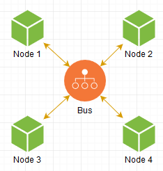

Когда нода хочет послать сообщение другой, она делает запрос к Bus, и уже он в свою очередь пересылает его куда надо, все просто. Наша сеть готова!

**FIN.**

..но ведь не все так просто?)

При таком подходе мы упираемся в производительность этого промежуточного звена, да и вообще хотелось бы напрямую обращаться к нужным нодам, ведь что может быть быстрее общения на прямую? Так давайте двинемся именно в эту сторону!

Что нужно в первую очередь? Собственно, законнектить один инстанс к другому. Но как первому узнать об существовании второго? Мы же хотим иметь их бесконечное количество, произвольно поднимать/убирать! Нужен мастер-сервер, адрес которого заведомо известен, к нему все коннектятся, за счет чего он знает все существующие ноды в сети и этой информацией добросердечно делиться с всеми желающими.

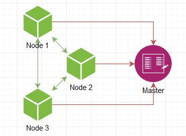

Т е нода поднимается, говорит мастеру о своем пробуждении, он дает список других активных нод, мы к ним подключаемся и все, сеть готова. В качестве мастера может выступать Consul или что-то подобное, но поскольку мы велосипедим то и мастер должен быть самопальный.

Отлично, теперь мы располагаем собственным скайнетом! Но текущая реализация чата в нем уже не пригодна. Давайте, собственно, придумаем требования:

1. Когда пользователь шлет сообщение, мы должны знать КОМУ он его шлет, т е иметь доступ к участникам комнаты.
2. Когда мы получили участников мы должны доставить им сообщения.
3. Мы должны знать какой пользователь в онлайне сейчас
4. Для удобства - дать пользователям возможность подписываться на онлайн статус других пользователей, чтоб в реальном времени узнавать об его изменении

Давайте разберемся с пользователями. Например, можно сделать чтоб мастер знал к какой ноде какой юзерь подключен. Ситуация следующая:

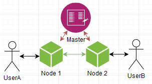

Два пользователя подсоединены к разным нодам. Мастер знает об этом, ноды знают что мастер знает. Когда UserB авторизуется, Node2 уведомляет об этом Master, который "запоминает" что UserB присоединен к Node2. Когда UserA захочет послать сообщение UserB то получится следующая картина:

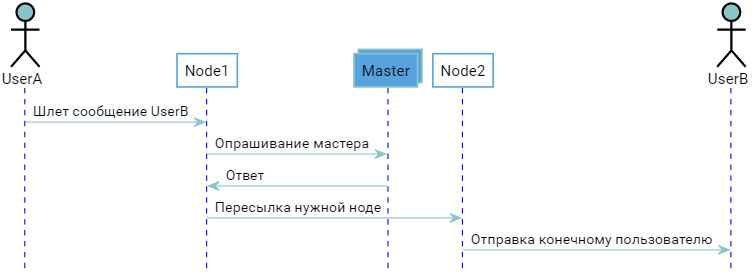

В принципе все работает, но хотелось бы избежать лишнего раунд трипа в виде опрашивания мастера, экономнее было бы сразу обращаться напрямую к нужной ноде, ведь именно ради этого все и затеивалось. Это можно сделать, если они будут сообщать всем окружающим какие пользователи к ним подключены, каждая из них становится самодостаточным аналогом мастера, и сам мастер становится не нужным, т к список соотношения "User=>Node" дублируется у всех. При старте ноде достаточно подключиться к любой уже запущенной, стянуть ее список себе и вуаля, она также готова к бою.

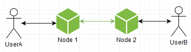

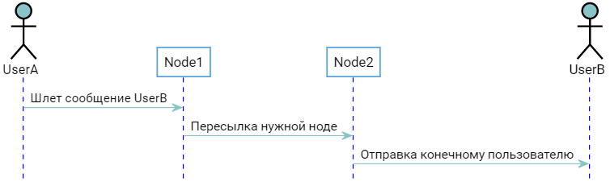

Но качестве trade off мы получаем дублирование списка, который хоть и являет собой соотношение "user id -> [host connections]", но все же при достаточном количестве пользователей получится довольно большим по памяти. Да и вообще пилить такое самому - это явно попахивает велосипедостроительной промышленностью. Чем больше кода - тем больше потенциальных ошибок. Пожалуй, заморозим этот вариант и глянем что уже есть из готового:

## Брокеры сообщений

Сущность реализующая тот самый "Bus", "промежуточное звено" упомянутое выше. Его задача - получение и доставка сообщений. Мы, как пользователи - можем подписаться на них и отсылать свои. Все просто.

Есть зарекомендовавшие себя RabbitMQ и Kafka: они только и делают что доставляют сообщения - таково их предназначение, напичканы всем необходимым функционалом по горло. В их мире сообщение должно быть доставлено, несмотря ни на что. 

В то же время есть Redis и его pub/sub - тоже что и вышеупомянутые ребята но более дубово: он просто тупо принимает сообщение и доставляет подписчику, без всяких очередей и остальных оверхедов. Ему абсолютно плевать на сами сообщения, пропадут они, подвис ли подписчик - он выбросит его и возьмется за новое, будто ему в руки кидают раскаленную кочергу от которой хочется избавиться по быстрее. Также, если он вдруг упадет - все сообщения также канут вместе с ним. Иными словами - ни о какой гарантии доставки речи не идет.

... и это то что нужно!

Ну действительно же, мы делаем просто чат. Не какой-то критический сервис по работе с деньгами или центр управления космическими полетами, а.. просто чат. Риск что условному Пете раз в год не придет одно сообщение из тысячи - им можно пренебречь, если в замен получаем рост производительности а в месте с ним количества пользователей за те же деньки, trade off во всей красе. Тем более что в то же время можно вести историю сообщений в каком нибудь персистентном хранилище, а значит Петя таки увидит то самое пропущенное сообщение перезагрузив страницу/приложение. Именно по этому остановимся на Redis pub/sub, а точнее: посмотрим на существующий адаптер для SocketIO который упоминается в статье на оф сайте https://socket.io/docs/using-multiple-nodes/

Так что это?

## Redis adapter

https://github.com/socketio/socket.io-redis

С его помощью обычное приложение посредством нескольких строчек и минимальным количеством телодвижений превращается в настоящий распределенный чат! Но как? Если посмотреть внутрь - оказывается там всего один файл на пол сотни строк.

https://github.com/socketio/socket.io-redis/blob/master/index.js

 В случай когда мы эмитим сообщение

```typescript
io.emit("everyone", "hello")
```

оно пушится в редис, передается всем другим инстансам нашего чата, которые в свою очередь эмитят его у себя уже локально по сокетам

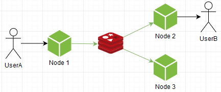

Сообщение разойдется по всех нодах даже если мы эмитим конкретному пользователю. Т е каждая нода принимает все сообщения и уже сама разбирается нужно ли оно ей.

Также, там реализован простенький rpc (вызов удаленных процедур), позволяющий не только отсылать но и получать ответы. Например можно управлять сокетами удаленно, типо "кто находится в указанной комнате", "приказать сокету присоединиться к комнате", и т д. 

Что с этим можно сделать? Например, использовать идентификатор пользователя в качестве имени комнаты (user id == room id). При авторизации джоинить сокет к ней, а когда мы захотим послать пользователю сообщение - просто шлем в нее. Еще, мы можем узнать онлайн ли юзер, элементарно глянув есть ли сокеты в указанной комнате.

В принципе на этом можно остановиться, но нам как всегда мало:

1. Бутылочное горлышко в виде одного инстанса редиса
2. Избыточность, хотелось бы чтоб ноды получали только нужные им сообщения

На счет пункта первого, глянем на такую штуку как:

## Redis cluster

Связывает между собой несколько инстансов редиса, после чего работают как единое целое. Но как он это делает? Да вот так:

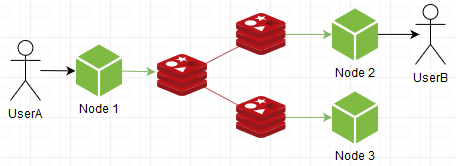

..и видим что сообщение дублируется всем участникам кластера. Т е он предназначен не для прироста производительности, а для повышения надежности, что конечно хорошо и нужно, но для нашего кейса не имеет ценности и никак не спасает ситуацию с бутылочным горлышком, плюс в сумме это еще больше расходования ресурсов.


Я новичек, многого не знаю, иногда приходится возвращаться к вилесопедостроению, чем мы и займемся. Нет, редис оставим дабы совсем не скатываться, но нужно что-то придумать с архитектурой ибо текущая никуда не годится. 

## Поворот не туда

Что нам нужно? Повысить общую пропускную способность. Например попробуем тупо заспавнить еще один инстанс. Представим что socket.io-redis умеет подключаться к нескольким, при пуше сообщения он выбирает рандомный, а подписывается на все. Получится вот так:

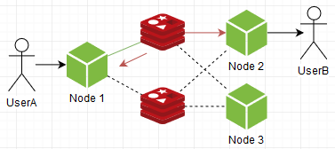

Вуаля! В общем и целом, проблема решена, редис теперь не узкое место, можно спавнить сколь угодно экземпляров! Зато им стали ноды. Да-да, инстансы нашего чатика по прежнему переваривают ВСЕ сообщения, кому бы они не предназначались.

Можно наоборот: подписываться на один рандомный, что уменьшит нагрузку на ноды, а пушить в все:

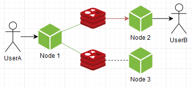

Видим что стало наоборот: ноды чувствуют себя спокойнее, но на инстанс редиса нагрузка выросла. Это тоже никуда не годится. Нужно чутка повелосипедить.

Дабы прокачать нашу систему оставим пакет socket.io-redis в покое, он хоть и классный но нам нужно больше свободы. И так, подключаем редис:

```typescript
//Отдельные каналы для:
const pub = new RedisClient({host: 'localhost', port: 6379})//Пуша сообщений
const sub = new RedisClient({host: 'localhost', port: 6379})//Подписок на них

//Также вспоминаем этот интерфейс
interface Message{
    roomId: string,//В какую комнату пишем
    message: string,//Что мы туда пишем
}
```

Настраиваем нашу систему сообщений:

```typescript
//Отлавливаем все приходящие сообщения тут
sub.on('message', (channel:string, dataRaw:string)=> {
    const data = <Message>JSON.parse(dataRaw)
    io.to(data.roomId).emit('message', data))
})

//Подписываемся на канал
sub.subscribe("messagesChannel")

//Присоеденяемся в указанную комнату
sock.on('join', (roomId:number)=> 
        sock.join(roomId))

//Пишем в комнату
sock.on('message', (data:Message)=> {
    
    //Публикуем в канал
    pub.publish("messagesChannel", JSON.stringify(data))
})
```

На данный момент получается как в socket.io-redis: мы слушаем все сообщения. Сейчас мы это исправим.

Организуем подписки следующим образом: вспоминаем концепцию с "user id == room id", и при появлении пользователя подписываемся на одноименный канал в редисе. Таким образом наши ноды будут получать только предназначенные им сообщения, а не слушать "весь эфир".

```typescript
//Отлавливаем все приходящие сообщения тут
sub.on('message', (channel:string, message:string)=> {
    io.to(channel).emit('message', message))
})

let UID:string|null = null;
sock.on('auth', (uid:string)=> {
    UID = uid
    
    //Когда пользователь авторизируется - подписываемся на 
    //одноименный нашему UID канал
    sub.subscribe(UID)
    
    //И соответствующую комнату
    sock.join(UID)
})
sock.on('writeYourself', (message:string)=> {
    
    //Пишем сами себе, т е публикуем сообщение в канал одноименный UID
    if (UID) pub.publish(UID, message)
})
```

Офигенно, теперь мы уверены что ноды получают только предназначенные им сообщения, ничего лишнего! Следует заметить, однако, что самих подписок теперь намного, намного больше, а значит будет кушать память ой йой йой, + больше операций подписки/отписки, которые сравнительно дорогие. Но в любом случае это придает нам некоторой гибкости, даже можно на этом моменте остановиться и пересмотреть заново все предыдущие варианты, уже с учетом нашего нового свойства нод в виде более выборочного, целомудренного получения сообщений. Например, ноды могут подписываться на один из нескольких инстансов редиса, а при пуше - отсылать сообщение в все инстансы:

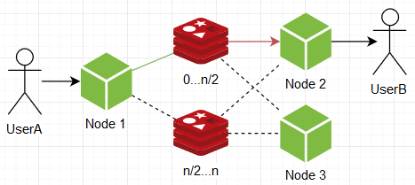


..но, как ни крути, они все равно не дают бесконечной расширяемости при разумных накладных расходах, нужно рожать иные варианты. В один момент в голову пришла следующая схема: а что если инстансы редисов поделить на группы, скажем А и В по два инстанса в каждой. Ноды при подписке подписываются по одному инстансу от каждой группы, а при пуше отсылают сообщение в все инстансы какой-то одной рандомной группы.

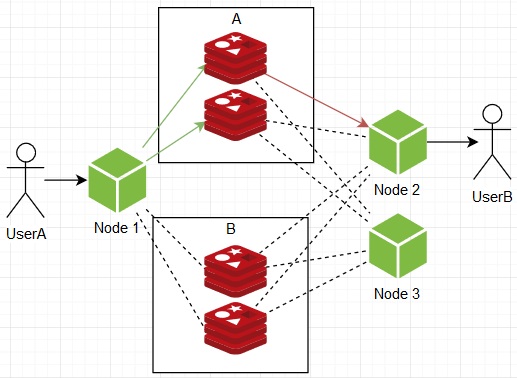

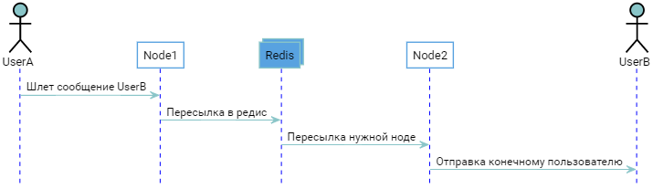

Таким образом мы получаем действующую структуру с бесконечным потенциалом расширяемости в реальном времени, нагрузка на отдельный узел в любой точке не зависит от размера системы, ибо:

1. Общая пропускная способность делится между группами, т е при увеличении пользователей/активности просто спавним дополнительные группы
2. Менеджмент пользователями (подписками) делится внутри самих групп, т е при увеличении пользователей/подписок просто наращиваем количество инстансов внутри групп

...и как всегда есть одно "НО": чем больше оно все становится, тем больше ресурсов нужно для следующего прироста, это мне кажется непомерным trade off. 

Вообще, если подумать - вышеупомянутые затыки исходят из незнания на какой ноде какой пользователь. Ну ведь действительно, имея мы эту информацию могли б пушить сообщения сразу куда надо, без лишнего дублирования. Что мы пытались сделать все это время? Пытались сделать систему бесконечно масштабируемой, при этом не имея механизма четкой адресации, из за чего неизбежно упарывались либо в тупик, либо в неоправданную избыточность. Например можно вспомнить об мастере, выполняющий роль "адресной книги":

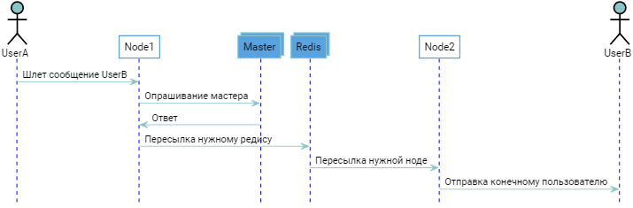

> Что-то похожее рассказывает этот чувак:
>
> https://youtu.be/6G22a5Iooqk

Чтобы получить местонахождение пользователя мы проделываем дополнительный раундтрип, что в принципе О'К, но не в нашем случае. Кажется мы копаем в не совсем правильную сторону, нужно что-то иное...

## Сила хэша

Есть такая штука как хэш. У него есть некоторый конечный диапазон значений. Получить его можно из любых данных. А что если разделить этот диапазон между инстансами редиса? Ну вот берем мы идентификатор пользователя, производим хэш, и в зависимости от диапазона в котором он оказался подписываемся/пушим в один определенный инстанс. Т е мы заранее не знаем где какой юзерь существует, но получив его айди можем с уверенностью сказать что он именно в n инстансе, инфа 100. Теперь то же самое, но с кодом:

```typescript
function hash(val:string):number{/**/}//Наша хэш-функция, возвращающая число
const clients:RedisClient[] = []//Массив клиентов редиса
const uid = "some uid"//Идентификатор пользователя

//Теперь, такой не хитрой манипуляцией мы получаем всегда один и тот же
//клиент из множества для данного пользователя
const selectedClient = clients[hash(uid) % clients.length]
```

Вуаля! Теперь мы не зависим от количества инстансов от слова вообще, можем скалироваться сколь угодно без оверхедов! Ну серьезно, это же гениальный вариант, единственный минус которого: нужда в полном перезапуске системы при обновлении количества редис-инстансов. Есть такая штука как Стандартное кольцо и Партиционное кольцо (https://4gophers.ru/articles/standartnoe-kolco-basic-hash-ring/) позволяющие побороть это, но они не применимы в условиях системы обмена сообщениями. Ну т е сделать логику миграции подписок между инстансами можно, но это стоит еще дополнительный кусок кода непонятного размера, а как мы знаем - чем больше кода, тем больше багов, нам этого не надо, спасибо. Да и в нашем случае downtime вполне допустимый tradeoff.

Еще можно посмотреть на RabbitMQ с его плагином https://github.com/rabbitmq/rabbitmq-sharding позволяющий вытворять то же что и мы, и + обеспечивает миграцию подписок (как я говорил выше - он обвязан функционалом с ног до головы). В принципе можно взять его и спать спокойно но, если кто шарит в его тюнинге дабы вывести в realtime режим оставив только лишь фичу с хэш рингом.

Залил репозиторий на гитхаб

https://github.com/Alster/distributed-nodejs-chat-with-redis

В нем реализован тот финальный вариант к которому мы пришли. Помимо всего, там есть дополнительная логика по работе с комнатами (диалогами).

В общем, я доволен и можно закругляться.

## Итого

Можно сделать что угодно, но есть такая штука как ресурсы, а они конечны, поэтому нужно извиваться.

Мы начали с полного незнания как могут работать распределенные системы к более менее осязаемым конкретным паттернам, и это хорошо.